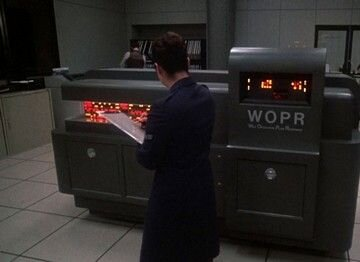

# WOPR
This the last version of the NORAD operating system for the WOPR mainframe computer, in use during the 1980s for war simulations in the US Strategic Command. 

Below is an image of the last operating WOPR at NORAD, in the late 1980s. 

  

One notable event, was when WOPR staged a massive Soviet first strike with hundreds of missiles, submarines, and bombers. Believing the attack to be genuine, NORAD prepared to retaliate, and only narrowly avoided a nuclear apocalypse.
  
The full WOPR OS is included here, for educational purposes only. 
  

  

Using WOPR
========== 

chmod +x wopr.sh 
./wopr.sh 

WOPR is best served thru a telnet or ssh connection, so other users can learn from this historical operating system. 

enjoy!

February 2025

moshix  
