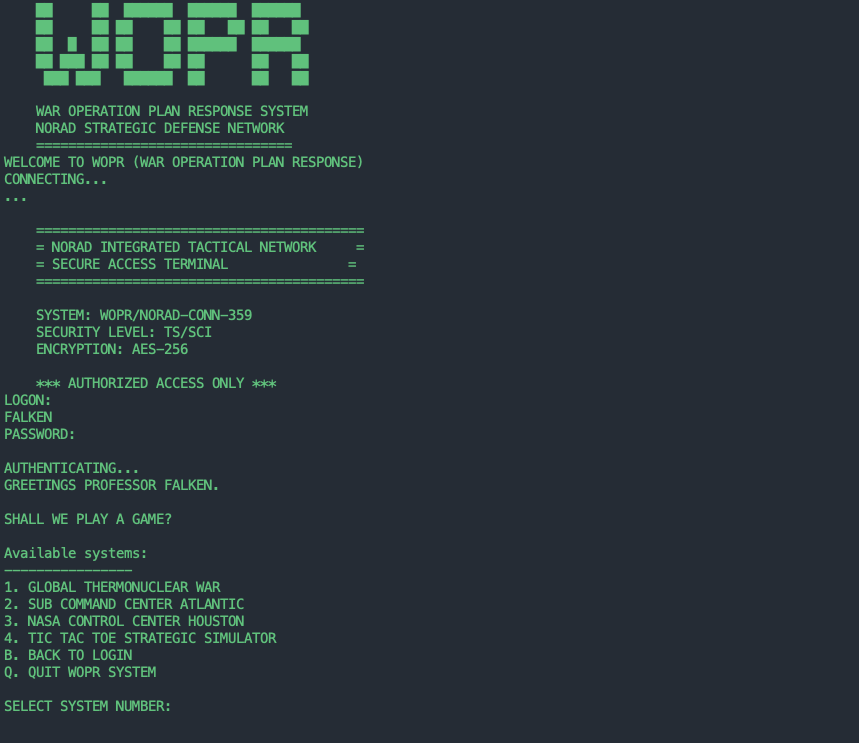

# WOPR
The NORAD operating systme for WOPR, used during the 1980s for war simulations. 

One notable event, was when WOPR staged a massive Soviet first strike with hundreds of missiles, submarines, and bombers. Believing the attack to be genuine, NORAD prepared to retaliate, and only narrowly avoided a nuclear apocalypse.

The full WOPR OS is included here, for educational purposes only. 

  

Using WOPR
========== 

chmod +x wopr.sh
./wopr.sh 

WOPR is best served thru a telnet or ssh connection, so other users can learn from this historical operating system. 

enjoy!

February 2025

moshix  
